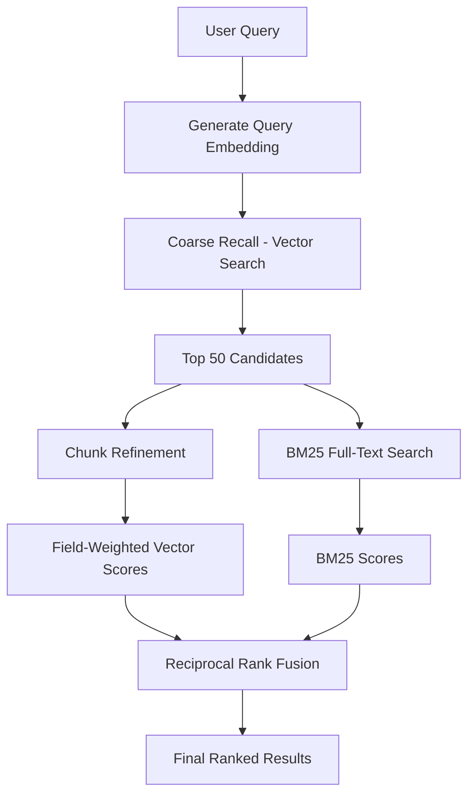
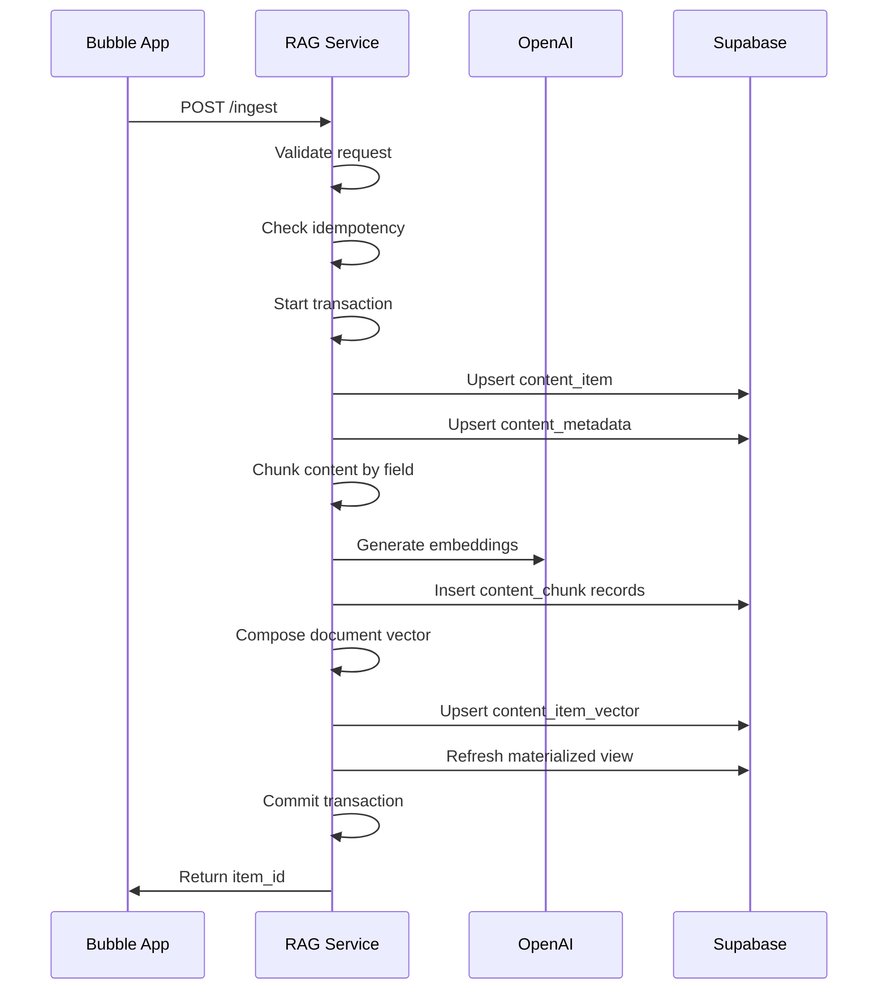
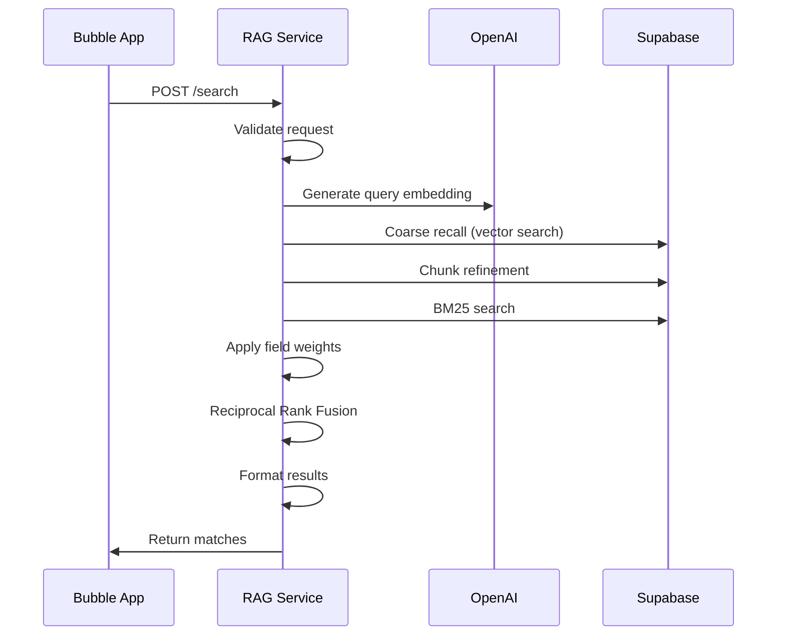

# Architecture Guide

Technical architecture and design decisions for the RAG Service.

## System Overview

The RAG Service is a production-ready Node.js application that provides hybrid search capabilities combining vector similarity search with full-text search. It's designed to integrate seamlessly with Bubble applications while maintaining high performance and reliability.

## High-Level Architecture

```
┌─────────────────────────────────────────────────────────────────┐
│                        RAG Service                             │
├─────────────────────────────────────────────────────────────────┤
│  ┌─────────────┐  ┌─────────────┐  ┌─────────────┐           │
│  │   Ingest    │  │   Search    │  │   Health    │           │
│  │   API       │  │   API       │  │   API       │           │
│  └─────────────┘  └─────────────┘  └─────────────┘           │
├─────────────────────────────────────────────────────────────────┤
│  ┌─────────────┐  ┌─────────────┐  ┌─────────────┐           │
│  │  Chunking   │  │ Embeddings │  │   Vector    │           │
│  │  Service    │  │  Service   │  │ Composition │           │
│  └─────────────┘  └─────────────┘  └─────────────┘           │
├─────────────────────────────────────────────────────────────────┤
│  ┌─────────────┐  ┌─────────────┐  ┌─────────────┐           │
│  │  OpenAI     │  │  Supabase  │  │  Logging   │           │
│  │  Client     │  │  Client    │  │  Service   │           │
│  └─────────────┘  └─────────────┘  └─────────────┘           │
└─────────────────────────────────────────────────────────────────┘
                                │
                                ▼
┌─────────────────────────────────────────────────────────────────┐
│                    External Services                            │
├─────────────────────────────────────────────────────────────────┤
│  ┌─────────────┐  ┌─────────────┐  ┌─────────────┐           │
│  │   OpenAI    │  │  Supabase   │  │   Bubble    │           │
│  │   API       │  │  Database   │  │   Apps      │           │
│  └─────────────┘  └─────────────┘  └─────────────┘           │
└─────────────────────────────────────────────────────────────────┘
```

## Core Components

### 1. API Layer

#### Express.js Server
- **Framework**: Express.js with TypeScript
- **Middleware**: JSON parsing, request logging, error handling
- **Security**: Request size limits (10MB), input validation
- **Observability**: Request ID tracking, structured logging

#### Route Handlers
- **Health Check**: Simple health monitoring endpoint
- **Ingest API**: Content ingestion with idempotency
- **Search API**: Hybrid search with RRF ranking

### 2. Processing Layer

#### Chunking Service (`src/chunk.ts`)
- **Tokenizer**: `@dqbd/tiktoken` for accurate token counting
- **Strategy**: Sliding window with overlap for content preservation
- **Configuration**: 1000 token chunks with 50 token overlap
- **PII Protection**: Automatic removal of emails and phone numbers

#### Embeddings Service (`src/embeddings.ts`)
- **Provider**: OpenAI text-embedding-3-small (1536 dimensions)
- **Field Weights**: Configurable importance weights per field type
- **Composition**: Weighted mean for document-level vectors
- **Fallback**: Support for text-embedding-3-small (1536 dimensions)

#### Vector Operations
- **Mean Calculation**: Simple arithmetic mean of embeddings
- **Weighted Mean**: Field-weighted composition of document vectors
- **Normalization**: Cosine similarity for vector comparisons

### 3. Data Layer

#### Database Schema

```sql
-- Core content table
content_item (
  id uuid PRIMARY KEY,
  type content_type NOT NULL,
  source_id text NOT NULL,
  version int DEFAULT 1,
  title text,
  description text,
  created_at timestamptz DEFAULT now(),
  updated_at timestamptz DEFAULT now(),
  UNIQUE(type, source_id, version)
)

-- Faceted metadata
content_metadata (
  item_id uuid PRIMARY KEY REFERENCES content_item(id),
  facets jsonb NOT NULL DEFAULT '{}'
)

-- Chunked content with embeddings
content_chunk (
  id uuid PRIMARY KEY,
  item_id uuid REFERENCES content_item(id),
  field text NOT NULL,
  chunk_index int DEFAULT 0,
  text text NOT NULL,
  char_count int GENERATED ALWAYS AS (length(text)) STORED,
  embedding vector(1536),
  created_at timestamptz DEFAULT now()
)

-- Document-level vectors
content_item_vector (
  item_id uuid PRIMARY KEY REFERENCES content_item(id),
  method text DEFAULT 'weighted-mean',
  embedding vector(1536)
)

-- Full-text search materialized view
content_item_ft (
  id uuid,
  type content_type,
  title text,
  description text,
  tsv tsvector
)
```

#### Indexes and Performance

```sql
-- Vector similarity indexes
CREATE INDEX idx_content_chunk_embedding ON content_chunk 
USING ivfflat (embedding vector_cosine_ops) WITH (lists = 100);

CREATE INDEX idx_content_item_vector_embedding ON content_item_vector 
USING ivfflat (embedding vector_cosine_ops) WITH (lists = 100);

-- Full-text search index
CREATE INDEX idx_content_item_ft_tsv ON content_item_ft 
USING gin(tsv);

-- Standard indexes
CREATE INDEX idx_content_chunk_item_id ON content_chunk(item_id);
CREATE INDEX idx_content_chunk_field ON content_chunk(field);
```

### 4. Search Algorithm

#### Two-Stage Hybrid Search



#### Stage 1: Coarse Recall
- **Method**: Vector similarity search on document-level embeddings
- **Index**: IVFFLAT with cosine similarity
- **Candidates**: Top 50 results for refinement
- **Filtering**: Content type and faceted metadata filters

#### Stage 2: Chunk Refinement
- **Vector Scoring**: Cosine similarity with field weights
- **BM25 Scoring**: Full-text search over materialized view
- **Fusion**: Reciprocal Rank Fusion (RRF) combines scores
- **Ranking**: Final relevance scoring and result ordering

#### Reciprocal Rank Fusion Formula

```
RRF_score = 1/(60 + vector_rank) + 1/(60 + bm25_rank)
```

Where:
- `vector_rank`: Position in vector similarity results
- `bm25_rank`: Position in BM25 full-text results
- `60`: RRF constant for score normalization

## Data Flow

### Ingest Flow



### Search Flow



## Configuration

### Environment Variables

| Variable | Type | Default | Description |
|----------|------|---------|-------------|
| `PORT` | number | 3000 | Server port |
| `OPENAI_API_KEY` | string | - | OpenAI API key (required) |
| `SUPABASE_URL` | string | - | Supabase project URL (required) |
| `SUPABASE_SERVICE_ROLE_KEY` | string | - | Service role key (required) |
| `EMBED_MODEL` | string | text-embedding-3-large | OpenAI embedding model |
| `EMBED_DIM` | number | 1536 | Embedding dimensions |
| `IVF_LISTS` | number | 100 | IVFFLAT index lists |
| `LOG_LEVEL` | string | info | Logging level |

### Field Weights Configuration

```typescript
const FIELD_WEIGHTS = {
  Title: 3.0,           // Highest priority
  CoachingPoints: 2.0,   // High priority
  Purpose: 1.5,         // Medium-high priority
  Description: 1.2,      // Medium priority
  Setup: 1.2,           // Medium priority
  Adaptations: 1.1,     // Low-medium priority
  LearningQuestions: 1.1, // Low-medium priority
  Transcription: 1.0    // Base priority
};
```

## Security Considerations

### Data Protection
- **PII Stripping**: Automatic removal of emails and phone numbers
- **Service Role**: Database access via service role key only
- **No CORS**: No cross-origin requests by default
- **Input Validation**: Zod schema validation for all inputs

### Access Control
- **Service Role Key**: Never exposed to client applications
- **Database RLS**: Row-level security policies (commented for service role access)
- **Request Limits**: 10MB JSON payload limit
- **Error Sanitization**: No sensitive data in error responses

## Performance Characteristics

### Embedding Generation
- **Model**: text-embedding-3-small (1536 dimensions)
- **Cost**: ~$0.00013 per 1K tokens
- **Latency**: ~200-500ms per batch
- **Batch Size**: Configurable, typically 10-100 texts

### Vector Search Performance
- **Index Type**: IVFFLAT with cosine similarity
- **Recall**: ~95% accuracy with proper list configuration
- **Latency**: ~10-50ms for coarse recall
- **Scalability**: Linear with IVF_LISTS parameter

### Full-Text Search Performance
- **Index Type**: GIN index on tsvector
- **Latency**: ~5-20ms for BM25 scoring
- **Scalability**: Logarithmic with content size
- **Refresh**: Materialized view refresh (fire-and-forget)

### Memory Usage
- **Chunking**: ~1MB per 1000 chunks
- **Embeddings**: ~12KB per embedding (1536 × 4 bytes)
- **Indexes**: ~10-50MB for typical datasets
- **Total**: ~100-500MB for production workloads

## Scalability Considerations

### Horizontal Scaling
- **Stateless Design**: No server-side state storage
- **Load Balancing**: Multiple instances behind load balancer
- **Database Connection**: Connection pooling via Supabase client

### Vertical Scaling
- **CPU**: Embedding generation is CPU-intensive
- **Memory**: Vector operations benefit from more RAM
- **Storage**: Database storage scales with content volume

### Database Scaling
- **Read Replicas**: Supabase read replicas for search queries
- **Partitioning**: Consider table partitioning for very large datasets
- **Index Maintenance**: Regular VACUUM and ANALYZE operations

## Monitoring and Observability

### Structured Logging
```json
{
  "level": "info",
  "time": "2024-01-15T10:30:00.000Z",
  "requestId": "uuid",
  "message": "Search completed successfully",
  "duration": 245,
  "resultCount": 10,
  "candidateCount": 50
}
```

### Key Metrics
- **Request Duration**: End-to-end request processing time
- **Token Counts**: Embedding generation token usage
- **Search Performance**: Candidate counts and result counts
- **Error Rates**: Failed requests and error types
- **Database Performance**: Query execution times

### Health Checks
- **Service Health**: Basic endpoint availability
- **Database Health**: Connection and query execution
- **External Services**: OpenAI API availability
- **Index Health**: Vector index performance metrics

## Deployment Architecture

### Development Environment
```
Developer Machine
├── Node.js 20+
├── TypeScript
├── pnpm (or npm)
├── Local .env file
└── Supabase CLI (optional)
```

### Production Environment
```
Load Balancer
├── RAG Service Instance 1
├── RAG Service Instance 2
└── RAG Service Instance N
    ├── Supabase Database
    ├── OpenAI API
    └── Monitoring Service
```

### Container Deployment
```dockerfile
FROM node:20-alpine
WORKDIR /app
COPY package*.json ./
RUN npm ci --only=production
COPY dist/ ./dist/
EXPOSE 3000
CMD ["node", "dist/server.js"]
```

## Future Enhancements

### Planned Features
- **Caching Layer**: Redis for embedding and search result caching
- **Rate Limiting**: Per-client rate limiting and quotas
- **Analytics**: Search analytics and usage metrics
- **Multi-tenancy**: Support for multiple organizations
- **Advanced Chunking**: Semantic chunking with overlap optimization

### Performance Optimizations
- **Batch Processing**: Asynchronous embedding generation
- **Index Optimization**: HNSW indexes for better vector search
- **Query Optimization**: Cached query plans and prepared statements
- **CDN Integration**: Static content delivery for large datasets

### Security Enhancements
- **API Keys**: Client authentication and authorization
- **Audit Logging**: Comprehensive audit trail
- **Data Encryption**: End-to-end encryption for sensitive content
- **Compliance**: GDPR and SOC2 compliance features
